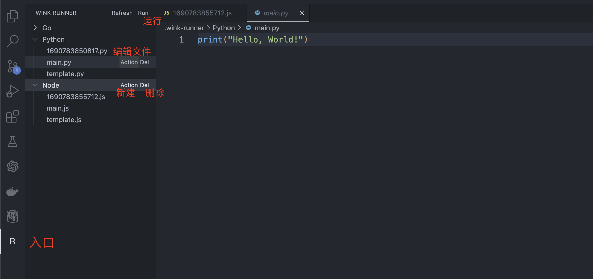

# wink-runner README
[README](README.md)|[中文文档](README.zh-CN.md)

I've always had this need: while writing code, I sometimes forget how to use a specific standard library, so I open my browser to look it up. However, I get distracted by various annoying ads, or I spend a lot of time searching without finding what I need. I know, some clever friends might say, "Hey, you have ChatGPT!" You're right, but what if ChatGPT starts talking nonsense? How should you respond then?

Another scenario is when I simply need to run a script temporarily to see its effect, but there's no script provided in the project folder for that purpose. I don't want to create a new file, and if I forget to add a .gitignore, that's a problem. In short, the main point is that I have this troublesome requirement, so I decided to create this thing.

## Installation
Simply install it from the VSCode plugin marketplace, or download and install it from [here](https://marketplace.visualstudio.com/items?itemName=yeuoly.wink-runner)

## Usage

It's quite simple and straightforward. Just click "Run" to execute the code. If you need to create a new file, use the "Action" button in the top-level directory. To edit a file, use the "Action" button on the file.

## Compile
```bash
npm install
npm run compile
```