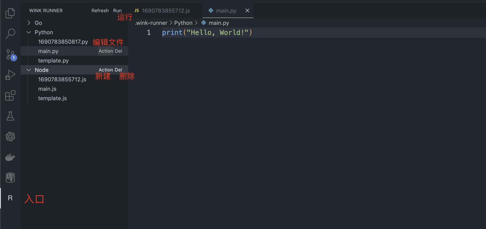

# wink-runner README
[README](README.md)|[中文文档](README.zh-CN.md)

我一直有这么个需求，写代码写着写着忘了某个标准库具体怎么用，于是就打开浏览器去查，然后被各种乱七八糟的广告分散注意力，或者找半天找不到想要的，我知道，现在聪明的朋友就要说了，我有ChatGPT，你说的对，但是如果ChatGPT开始跟你胡说八道，阁下又该如何应对。

还有一些场景就是我只是单纯的需要临时跑一个脚本看看代码效果，但是项目文件夹里没有给我用来做这个事情的脚本，我又不想去新建一个文件，如果我忘记加.gitignore，那就哦豁了，总而言之言而总之就是这么个破需求，于是我就写了这个玩意。

## 安装
直接从VSCode插件市场安装即可，或者在[这里](https://marketplace.visualstudio.com/items?itemName=yeuoly.wink-runner)下载安装。

## 使用

很简单暴力，点击Run运行即可，新建文件就点顶级目录上的Action，编辑文件就点文件上的Action

## 编译
```bash
npm install
npm run compile
```